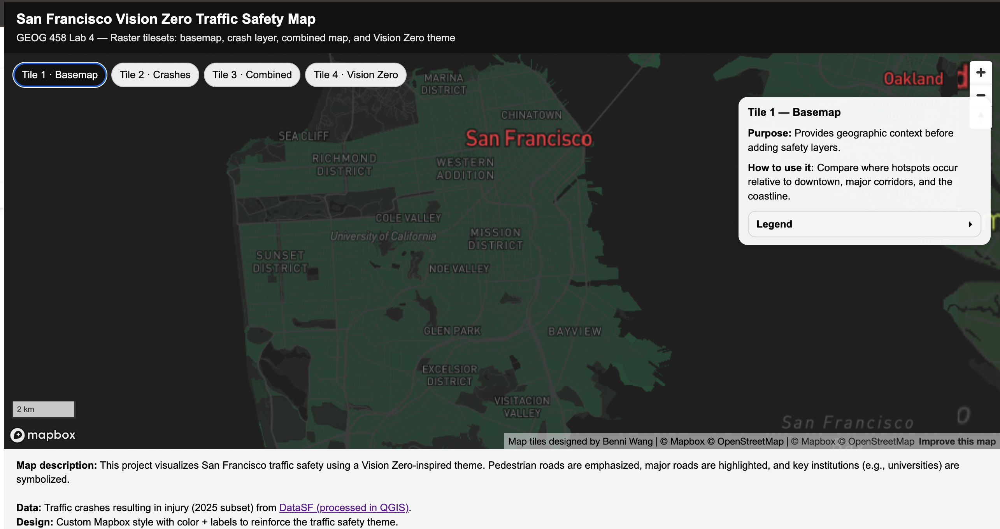
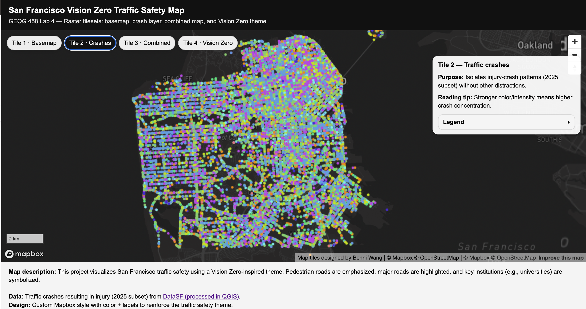
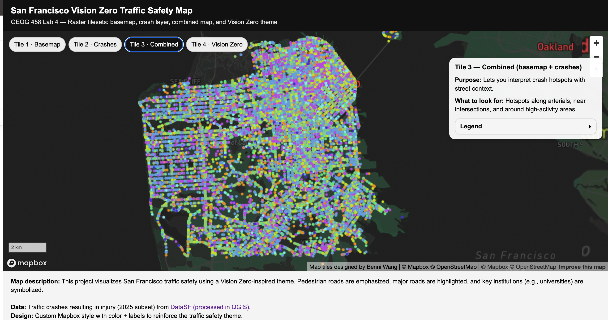
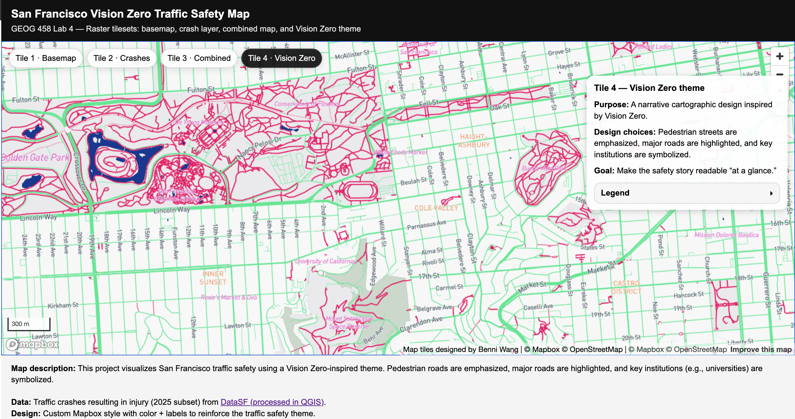

# San Francisco Vision Zero Traffic Safety Map
GEOG 458 – Lab 4 (Raster Tile Sets)

## 🔗 Web Map URL

You can access the interactive web map here:

👉 https://BenjaminWang123.github.io/Lab4_tiles/

---

## 🗺 Examined Geographic Area

This project examines **San Francisco, California**, focusing on the urban core and surrounding neighborhoods.
The map highlights traffic safety patterns within the city boundary, including:

- Downtown San Francisco
- Major arterial corridors
- Residential neighborhoods
- Areas with high pedestrian activity

The geographic extent covers approximately:
- Longitude: -122.55 to -122.35
- Latitude: 37.70 to 37.83

This area aligns with the San Francisco city limits and supports analysis of injury-related traffic crashes.

---

## 🔎 Available Zoom Levels

Each raster tile set was exported with the following zoom levels 11 to 15.

- Lower zoom levels provide city-wide pattern recognition.
- Higher zoom levels allow detailed street-level examination of crash clusters and corridor design.

---

## 🧱 Tile Set Descriptions

### 🟦 Tile 1 – Basemap

A clean reference basemap providing geographic context.
It includes:

- Street network
- Urban form
- Coastline
- Neighborhood structure

This layer serves as the foundational context before adding crash data.

---

### 🟥 Tile 2 – Traffic Crashes

This tile set visualizes injury-related traffic crashes (2025 subset).

- Higher intensity indicates greater crash concentration.
- Designed to highlight spatial patterns without contextual distractions.
- Useful for identifying safety hotspots across the city.

Data Source: DataSF – Traffic Crashes Resulting in Injury (processed in QGIS)

---

### 🟪 Tile 3 – Combined (Basemap + Crashes)

This layer merges the basemap with crash intensity data.

- Allows comparison between crash hotspots and street hierarchy.
- Helps identify relationships between major corridors and injury clusters.
- Supports spatial interpretation of safety risk areas.

---

### 🟨 Tile 4 – Vision Zero Theme

A cartographic design inspired by San Francisco’s Vision Zero initiative.

Design characteristics:
- Major corridors emphasized
- Pedestrian-oriented streets highlighted
- Key institutions symbolized
- Simplified visual hierarchy for safety storytelling

This thematic tile set transforms raw crash data into a policy-oriented visual narrative.

---

## 📸 Screenshots of Tile Sets

### Tile 1 – Basemap

### Tile 2 – Traffic Crashes

### Tile 3 – Combined

### Tile 4 – Vision Zero Theme

---

## 📚 Data Source

Traffic Crashes Resulting in Injury (2025 subset)
Source: https://data.sfgov.org/Public-Safety/Traffic-Crashes-Resulting-in-Injury/ubvf-ztfx/about_data

Processed and exported as raster tiles in QGIS.

---

## 👤 Author

Benni Wang
University of Washington
GEOG 458 – Digital Geographies
